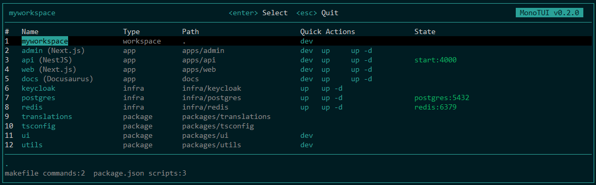

# MonoTUI

MonoTUI is a **Text User Interface (TUI)** dashboard for managing **Node monorepos**.

Start, stop, and monitor all your apps, packages, and infrastructure from one interactive UI.

This project was developed using Ink/React for rapid prototyping.



## Features

- Auto-discovers projects from package.json, docker-compose.yml, and Makefile
- Interactive keyboard navigation
- Start / stop services
- Real-time status

## Install

```sh
pnpm add @factorim/monotui
```

Generate a config file:

```sh
pnpm exec monotui-init
```


## Usage

You can run MonoTUI directly:

```sh
pnpm monotui
```

Or add a script to your `package.json` for convenience:

```json
"scripts": {
	"tui": "monotui"
}
```

Then run:

```sh
pnpm tui
```

## Project Structure

MonoTUI expects a standard monorepo layout:

```text
apps/        # runnable applications (frontend, backend)
contracts/   # Ethereum smart contracts
packages/    # shared libraries
infra/       # infrastructure (docker-compose services)
```

## Development

Watch and compile TypeScript:

```sh
pnpm run dev
```

Run the TUI locally:

```sh
pnpm start
```

## License

MIT [License](./LICENSE)