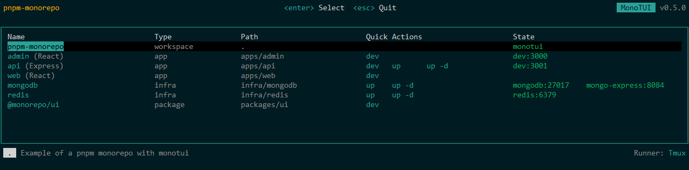

# MonoTUI

MonoTUI is a **Text User Interface (TUI)** dashboard for managing **Node monorepos**.

Start, stop, and monitor all your apps, packages, and infrastructure from one interactive UI.

This project was developed using Ink/React for rapid prototyping.



## Features

- Auto-discovers projects from package.json, docker-compose.yml, and Makefile
- Interactive keyboard navigation
- Start / stop services
- Real-time status

## Install

```sh
pnpm add -D @factorim/monotui
```

Generate a config file:

```sh
pnpm exec monotui-init
```

## Usage

MonoTUI supports two modes:

### 1. Instant Run

Run directly without creating a config file:

```sh
pnpm exec monotui
```

### 2. Config + Script Setup

Initialize once to create `monotui.config.mjs` and update `package.json` with a `monotui` script:

```sh
pnpm exec monotui-init
```

Then run:

```sh
pnpm monotui
```

## Example

MonoTUI ships with a sample pnpm monorepo to help you explore the UI before integrating it into your own project.

### Try the demo

```sh
# Clone the repository
git clone https://github.com/factorim/monotui.git

# Navigate to the example monorepo
cd monotui/examples/pnpm-monorepo

# Install dependencies
pnpm install

# Launch MonoTUI
pnpm run monotui
```

The demo monorepo includes a representative set of apps, packages, and infrastructure services so you can try starting, stopping right away.

## Monorepo Structure

MonoTUI expects a standard monorepo layout:

```text
apps/        # runnable applications (frontend, backend)
contracts/   # Ethereum smart contracts
packages/    # shared libraries
infra/       # infrastructure (docker-compose services)
```

This structure can be customized via the config file generated by `monotui-init`.

## Development

Watch and compile TypeScript:

```sh
pnpm run dev
```

Run the TUI locally:

```sh
pnpm start
```

## License

MIT [License](./LICENSE)